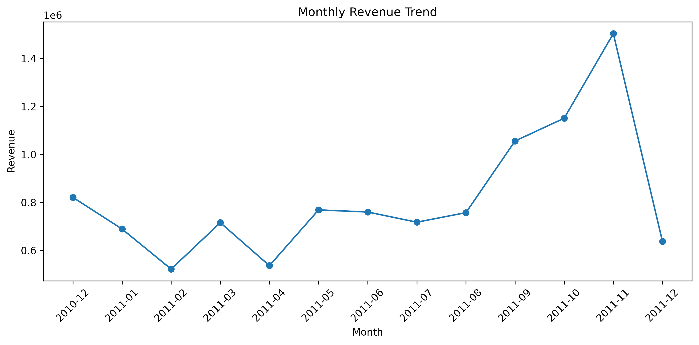
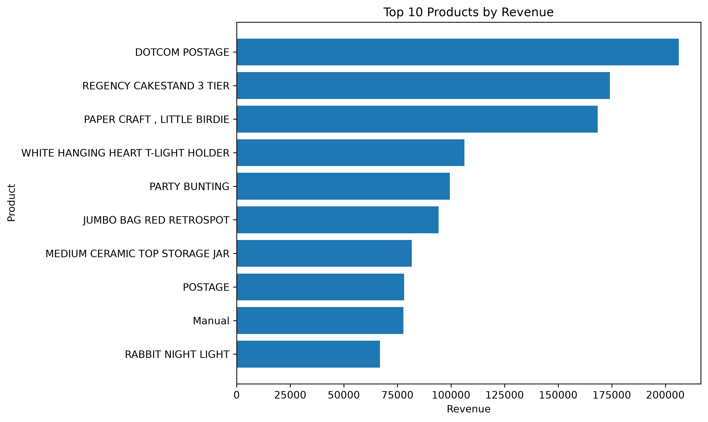
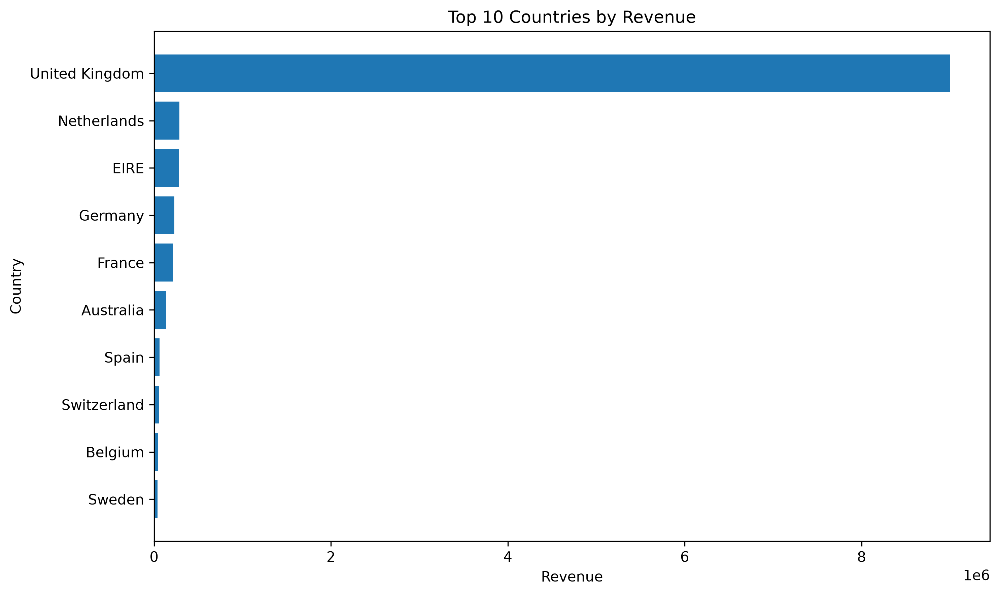
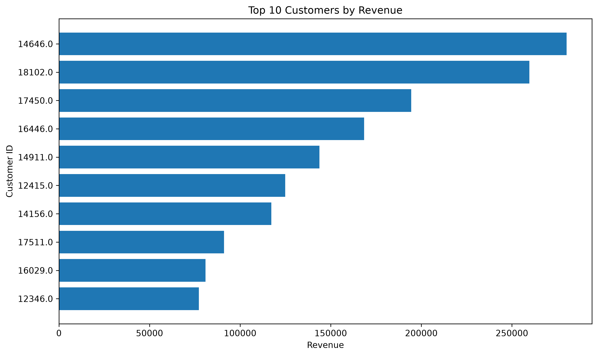
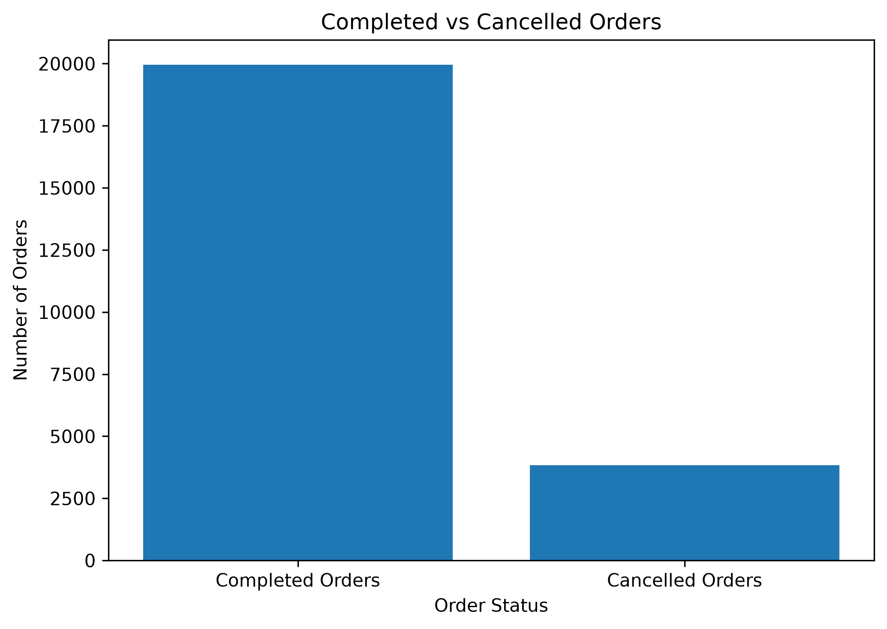

# Online Retail Sales Analysis

## Project Overview

This project analyzes online retail transaction data to identify sales trends, top-performing products, countries, customers, and order cancellations.

The project demonstrates beginner-level data analyst skills using Python, Pandas, Matplotlib, data cleaning, exploratory data analysis, and visualization.

## Business Questions

- What is the total revenue?
- How many unique orders were completed?
- What is the average order value?
- Which month generated the highest revenue?
- Which products generated the highest revenue?
- Which countries generated the highest revenue?
- Who are the highest-value customers?
- What percentage of orders were cancelled?

## Dataset

The project uses the Online Retail dataset from the UCI Machine Learning Repository.

The dataset contains transaction information including:

- Invoice number
- Product description
- Quantity
- Invoice date
- Unit price
- Customer ID
- Country

## Tools and Technologies

- Python
- Pandas
- Matplotlib
- Jupyter Notebook
- Visual Studio Code
- GitHub

## Data Cleaning

The following cleaning steps were performed:

- Removed 5,268 duplicate rows
- Removed rows with missing product descriptions
- Removed transactions with zero or negative quantities
- Removed transactions with zero or negative prices
- Created a Revenue column using Quantity multiplied by Unit Price
- Saved the cleaned dataset as a CSV file

## Key Performance Indicators

The project calculates:

- Total Revenue
- Total Orders
- Total Products Sold
- Average Order Value
- Cancelled Orders
- Cancellation Rate

## Analysis and Visualizations

### Monthly Revenue Trend



### Top 10 Products by Revenue



### Top 10 Countries by Revenue



### Top 10 Customers by Revenue



### Completed vs Cancelled Orders



## Project Structure

```text
online-retail-sales-analysis/
│
├── data/
│   ├── raw/
│   └── processed/
│       └── cleaned_online_retail.csv
│
├── images/
│   ├── monthly_revenue_trend.png
│   ├── top_10_products_by_revenue.png
│   ├── top_10_countries_by_revenue.png
│   ├── top_10_customers_by_revenue.png
│   └── completed_vs_cancelled_orders.png
│
├── notebooks/
│   └── sales_analysis.ipynb
│
├── sql/
├── README.md
└── .gitignore